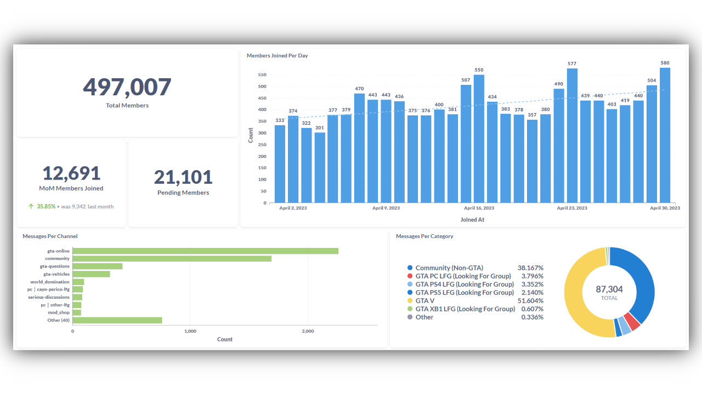

# Calico

## What is it?

Calico is an advanced metrics collection and dataproccessing tool designed for large Discord communities.

This project started as an internal tool for the GTA Online Discord community which consists of over 500k members. We wanted an easy and clean way to gather and display server information. Eventually as I was the only one working on the project I decided to make it open source and use it as a portfolio project.

# Table of contents

1. [Installation](#installation)
   - [Prerequisites](#prerequisites)
   - [Using the default Docker Compose](#Using-the-default-Docker-Compose)

## Installation

### Prerequisites

- Docker
- Linux Server

### Using the default Docker Compose

The default Docker Compose includes the bot, a Postgres instance, and a Metabase instance exposed on port 3000.

1. Create a `.env` and `.config.yml` file using the `.env.example` and `config-example.yml` as refrence.
2. Run `docker compose up --build`
3. Add metabase to your domain/webserver (Metabase runs on port 3000)
